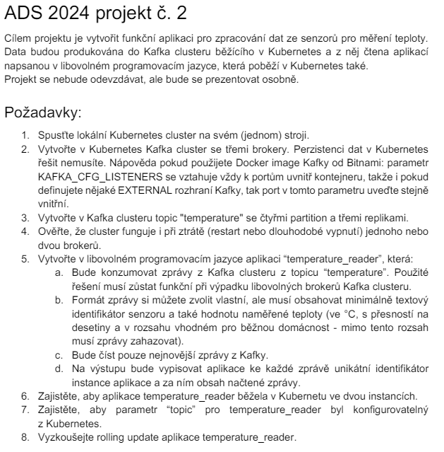

# 📃 Zadání


## 💪 Pomocné příkazy k demonstraci vypracování jednotlivých kroků
1. Spusťte lokální Kubernetes cluster na svém (jednom) stroji.<br>
```cmd
minikube start
```
```cmd
kubectl get nodes
```
```cmd
kubectl get service
```
💡 Jak nainstalovat minikube a kubectl níže ve zdrojích.

2. Vytvořte v Kubernetes Kafka cluster se třemi brokery. Perzistenci dat v Kubernetes
řešit nemusíte. Nápověda pokud použijete Docker image Kafky od Bitnami: parametr
KAFKA_CFG_LISTENERS se vztahuje vždy k portům uvnitř kontejneru, takže i pokud
definujete nějaké EXTERNAL rozhraní Kafky, tak port v tomto parametru uveďte stejně
vnitřní.<br>

📂 [k8s/kafka.yaml](https://github.com/jkuzel02/ads-projekt-2/blob/e0bf95d45c79308a25f9035adf824e135b77c4b6/k8s/kafka.yaml)<br>
📂 [k8s/zookeeper.yaml](https://github.com/jkuzel02/ads-projekt-2/blob/e0bf95d45c79308a25f9035adf824e135b77c4b6/k8s/zookeeper.yaml)

```cmd
cd k8s/

kubectl apply -f .
```

3. Vytvořte v Kafka clusteru topic "temperature" se čtyřmi partition a třemi replikami.<br>
```cmd
kubectl exec -it kafka-0 -- bash
```
```cmd
kafka-topics.sh --bootstrap-server kafka:9092 --create --topic temperature --replication-factor 3 --partitions 4
```
#### Další příkazy pro hraní si s topicem v kafce:
📝 Popis topicu:
```cmd
kafka-topics.sh --bootstrap-server kafka:9092 --describe --topic temperature
```
🗑️ Smazání topicu:
```cmd
kafka-topics.sh --bootstrap-server kafka:9092 --delete --topic temperature
```
📃 Listnutí všech topiců:
```cmd
kafka-topics.sh --bootstrap-server kafka:9092 --list
```
⚒ Producent pro topic:
```cmd
kafka-console-producer.sh --bootstrap-server kafka:9092 --topic temperature
```
💡 Vhodný formát zpráv je: {místnost;teplota}

4. Ověřte, že cluster funguje i při ztrátě (restart nebo dlouhodobé vypnutí) jednoho nebo
dvou brokerů.
```cmd
kubectl delete pod kafka-1
kubectl delete pod kafka-2
```
5. Vytvořte v libovolném programovacím jazyce aplikaci “temperature_reader”, která:<br>
a. Bude konzumovat zprávy z Kafka clusteru z topicu “temperature”. Použité
řešení musí zůstat funkční při výpadku libovolných brokerů Kafka clusteru.<br>
b. Formát zprávy si můžete zvolit vlastní, ale musí obsahovat minimálně textový
identifikátor senzoru a také hodnotu naměřené teploty (ve °C, s přesností na
desetiny a v rozsahu vhodném pro běžnou domácnost - mimo tento rozsah
musí zprávy zahazovat).<br>
c. Bude číst pouze nejnovější zprávy z Kafky.<br>
d. Na výstupu bude vypisovat aplikace ke každé zprávě unikátní identifikátor
instance aplikace a za ním obsah načtené zprávy.<br>
📂 [py/](https://github.com/jkuzel02/ads-projekt-2/tree/a138c9421bb770b9e681fec95b2fff449aedc06a/py)

#### 💡 Pro buildnutí image pro minikube je potřeba dostat se na docker v něm samotném.
- Přístup k dockeru v minikube & následný build image do repozitáře pro minikube
```cmd
eval $(minikube docker-env)
```
```cmd
cd ../py/

docker build -t temperature_reader .
```

- Odebrání přístupu
```cmd
eval $(minikube docker-env -u)
```

- Aplikace manifestu
```cmd
cd ../k8s/tempr/
kubectl apply -f .
```
🔦 Pro zjištění identifikátoru instance tempr (temperature_reader):
```cmd
kubectl get pod
```
```cmd
kubectl exec -it {nazev-tempr-podu} -- bash
```
```cmd
python temperature_reader.py
```


6. Zajistěte, aby aplikace temperature_reader běžela v Kubernetu ve dvou instancích.<br>
📂 [k8s/tempr/tempr.yaml](https://github.com/jkuzel02/ads-projekt-2/tree/a138c9421bb770b9e681fec95b2fff449aedc06a/k8s/tempr/tempr.yaml)
7. Zajistěte, aby parametr “topic” pro temperature_reader byl konfigurovatelný
z Kubernetes.<br>
📂 [k8s/tempr/tempr.yaml](https://github.com/jkuzel02/ads-projekt-2/tree/a138c9421bb770b9e681fec95b2fff449aedc06a/k8s/tempr/tempr.yaml)<br>
📂 [py/temperature_reader.py](https://github.com/jkuzel02/ads-projekt-2/blob/a138c9421bb770b9e681fec95b2fff449aedc06a/py/temperature_reader.py)
9. Vyzkoušejte rolling update aplikace temperature_reader.<br>
```cmd
kubectl rollout restart deployment tempr
```

### Zdroje

[Install minikube & kubectl (blog.devgenius.io)](https://blog.devgenius.io/how-to-install-minikube-on-ubuntu-22-04-step-by-step-4c70efc93dd6) <br>

[Blog - Kafka on k8s (phoenixnap.com)](https://phoenixnap.com/kb/kafka-on-kubernetes)

[Docker image bitnami/kafka](https://hub.docker.com/r/bitnami/kafka) <br>
[Docker image zookeeper](https://hub.docker.com/_/zookeeper)

[Dokumentace kafka-python lib](https://pypi.org/project/kafka-python/)<br>
[Blog - Kafka producent & konzument with python (needablackcoffee.medium.com)](https://needablackcoffee.medium.com/learn-apache-kafka-with-these-python-examples-454b5275109e)
